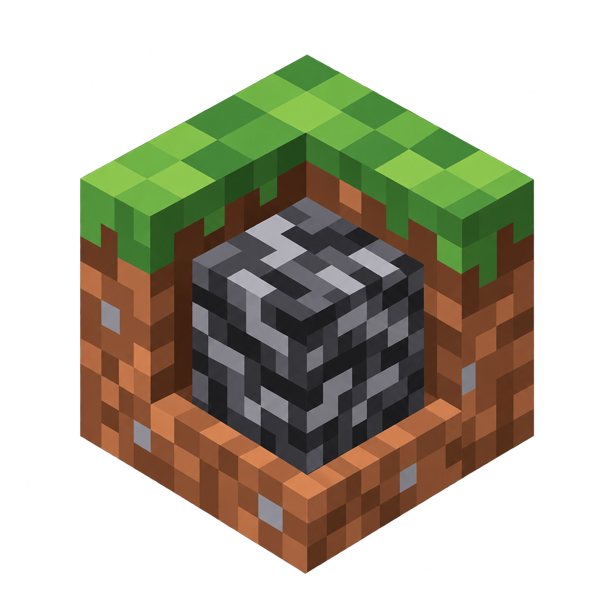

# TogetherWithBedrock

<p align="center">
  
</p>

**Crossplay between Minecraft: Java Edition and Bedrock — from the client side.**
TogetherWithBedrock adds a complete Bedrock menu to Minecraft Java Edition 26.2: play on Bedrock friends' worlds and Realms, host your own world for Bedrock players with automatic public tunnels, manage your server's content from in-game, and see everyone rendered properly — Bedrock skins, smooth movement, correct animations.

One mod jar. No external application, no bundled Java runtime, no manual proxy setup. Windows and Linux.

---

## Highlights

- **Real Bedrock crossplay** — join Bedrock friends' worlds, Realms and saved servers from Java Edition, and let Bedrock players join you
- **Self-contained** — the entire companion service ships inside the mod jar and runs on the Java you already launch Minecraft with
- **In-game server manager** — mods, datapacks, console, players, access control and tunnels, all from a screen, no SSH, no file transfer
- **Fully client-side** — nothing is installed on servers you don't own; joining a random Java server still works exactly as before

## Requirements

| | |
|---|---|
| Minecraft | **26.2** (Java Edition) |
| Loader | Fabric Loader **0.19.3+** |
| Fabric API | **0.158.0+26.2** |
| Java | **25** (the runtime you launch the game with) |
| OS | Windows or Linux (macOS untested but unprivileged) |
| Accounts | A signed-in Microsoft/Xbox account for Bedrock features |

---

## Capabilities

### Bedrock menu
- **Bedrock button on the title screen** (beside Minecraft Realms) opening a full menu UI
- **Account page** — Microsoft/Xbox sign-in handled through the embedded companion; credentials are stored privately per-profile and never leave your machine
- **Friends page** — see your Xbox friends, their online status, and which worlds are joinable right now
- **Join Bedrock worlds** — friends' public worlds and worlds you've been invited to, through an automatic local translation proxy
- **Saved servers** — add, edit and store Bedrock servers (Featured Servers included) in your server list like any Java server
- **Invites page** — a persistent inbox of Xbox game invitations, polled in the background, including while you're already playing
- **Invite notifications** — a clickable 30-second banner on the title screen when a new invite arrives; invites survive game restarts until dismissed or expired
- **Realms** — browse and join Bedrock Realms shared with your account

### World hosting for Bedrock players
- **Create hosted worlds** from the menu: name, seed, game mode, difficulty, player cap, memory — the mod provisions a real Fabric 26.2 server with Geyser + Floodgate automatically
- **Import existing Java saves** as hosted worlds (vanilla-compatible worlds)
- **Automatic public tunnels** through playit.gg — friends connect from anywhere without port forwarding; private worlds can use invite-only access instead
- **Access control** — public / friends-only / private visibility, per-player Xbox allowlist, whitelist enforcement
- **Players screen** — live player list, op/deop, kick, and game-mode controls for the host
- **Console screen** — full server console with output feed, from the game
- **Content management (while the world is stopped)**
  - **Mods tab** — browse and install Fabric mods from Modrinth with dependency resolution and checksum verification
  - **Datapacks tab** — search Modrinth for 26.2 datapacks, import ZIPs by picker or drag-and-drop, enable/disable/remove packs, dependency and conflict checks, recovery copies of removed packs
  - Optional **performance mod bundle** applied automatically
- **Broadcasting** — optional companion bot announces your hosted world to Xbox feeds so friends see it (MCXboxBroadcast, embedded)
- **Hosting screens** — Overview / Content / Sharing tabs with live status, logs and player feed

### Crossplay experience fixes
- **Bedrock skins rendered on Java** — skins of Bedrock players are fetched, converted and applied in-game (including cape variants and skin persistence across sessions)
- **Movement smoothing** — Bedrock players' positions are interpolated and corrected so they don't stutter or rubber-band on your screen
- **Swim-state & animation sync** — swimming, crawling and pose transitions translate correctly in both directions
- **Creative-mode bridge** — creative inventory actions from Bedrock players (pick-block, off-hand quirks) are translated to sane Java-side behavior
- **ItemPhysic compatibility** — drop animations of Bedrock players don't break under ItemPhysic
- **Host skin bridge** — a tiny server-side helper jar is offered to hosted worlds so skins render for everyone, not only the host

### Architecture that stays out of your way
- **Everything embedded** — the companion service (ViaProxy/ViaBedrock build, broadcast bot, Via templates) ships inside the mod jar, extracts to `bedrock-companion/` inside the game instance, and launches with the game's own Java
- **Private by design** — the companion talks to the mod over anonymous local pipes (no open ports on your machine); gameplay proxies bind to loopback only; public exposure happens exclusively through your playit tunnel
- **Crash isolation** — the companion is a separate process: if it dies, the game shows a recoverable error and can restart it; a parent watchdog cleans up orphans if Minecraft crashes
- **Per-server stable identity** — each Bedrock server/world/Realm keeps a stable logical address so Voxy/Xaero caches and reconnect mods keep working
- **Logs on demand** — Bedrock → Proxy → Open logs folder
- **Update in place** — replace the mod jar, hit *Restart service* in the Proxy screen; no re-login or reconfiguration

---

## Installation

1. Install **Minecraft 26.2** with **Fabric Loader 0.19.3+** (the [Fabric installer](https://fabricmc.net/use/installer/) does this in one click)
2. Drop **Fabric API 0.158.0+26.2** and the **TogetherWithBedrock** jar from [Releases](../../releases) into your `mods` folder
3. Launch the game with **Java 25** (newer launchers, including Prism, ship this)
4. Click **Bedrock** on the title screen → **Account** → sign in with your Microsoft account
5. Friends, Realms, saved servers and hosting are ready — no other setup

> Prefer `gh`? `gh release download -R <you>/TogetherWithBedrock -p '*.jar' -D mods` after installing.

## Building from source

Requirements: JDK 25 and Git. The build is plain Gradle (wrapper included); no external services are contacted at build time — the companion jars are vendored under `src/main/resources/assets/bedrockmenu/companion/`.

```bash
git clone https://github.com/snooped-xl/TogetherWithBedrock.git
cd TogetherWithBedrock
./gradlew build            # Linux/macOS
gradlew.bat build          # Windows
```

The finished mod is `build/libs/together-with-bedrock-<version>+26.2.jar`. CI builds it on every push; releases carry a ready-to-use 26.2 jar.

Useful tasks:

```bash
./gradlew test                     # unit tests
./gradlew serverSkinBridgeJar     # the optional host-side skin helper jar
```

### Replacing the embedded companion

The companion build is vendored, so forks can swap it: drop a new ViaProxy fork jar (containing `net.raphimc.viaproxy.bedrock.menu.MenuService`) and broadcast jar into `src/main/resources/assets/bedrockmenu/companion/`, adjust the Via `templates/*.yml` if needed, and rebuild. The runtime is content-addressed — the mod re-extracts automatically whenever the embedded jar changes.

## Project layout

```
src/main/java/dev/snooped/bedrockmenu/   mod sources (menus, hosting screens, companion client)
src/main/resources/.../companion/        vendored companion jars + Via templates (embedded)
ViaProxy-side hosting service sources live in the sibling fork repository
```

The companion service sources (MenuService, hosting backend, ViaBedrock protocol work) are maintained in a GPL-3.0 ViaProxy fork; this repository vendors its build output so the mod stays a single-file install.

## Data & logs

| What | Where |
|---|---|
| Companion runtime & hosting data | `<instance>/bedrock-companion/` |
| Hosted worlds & tunnel config | `<instance>/bedrock-companion/hosting/` |
| Saved Bedrock servers, sessions, invites | `<instance>/bedrock-companion/profile-v2/` |
| Mod preferences | `<instance>/config/bedrock-*.json` |
| Service & gameplay logs | `<instance>/bedrock-companion/profile-v2/companion.log`, `gameplay.log` |

Nothing is written outside the game instance. Deleting `bedrock-companion/` resets all Bedrock menu state (including hosted worlds — don't unless you mean it).

## License

This project is **GPL-3.0-or-later** (see [LICENSE](LICENSE)). It vendors builds of GPL-licensed components: [ViaProxy](https://github.com/ViaVersion/ViaProxy) and related Via projects, and [MCXboxBroadcast](https://github.com/talmahr/MCXboxBroadcast) — their source remains available upstream, and their licenses apply to the vendored binaries. Public tunneling uses [playit.gg](https://playit.gg); its agent is downloaded at runtime under its own license. Minecraft is a trademark of Mojang; this project is not affiliated with Mojang or Microsoft.
